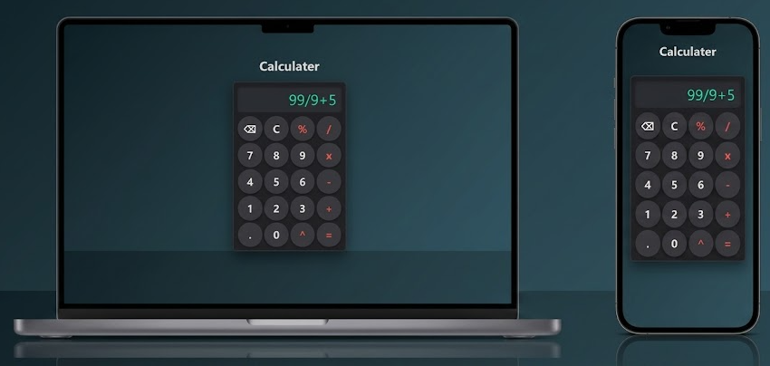

# 🧮 Calculator

A simple and modern **Calculator Web App** built using **HTML, CSS, and JavaScript**.

This project provides a clean dark-themed calculator interface with basic arithmetic operations, percentage, power, decimal calculations, clear, and backspace functionality.

## ✨ Features

* ➕ Addition
* ➖ Subtraction
* ✖️ Multiplication
* ➗ Division
* `%` Percentage
* `^` Power
* `.` Decimal numbers
* `C` Clear display
* `⌫` Backspace
* `=` Calculate result
* ⚠️ Error handling
* 📱 Responsive design
* 🎨 Modern dark UI
* ✨ Button hover animations

## 🛠️ Technologies Used

* HTML5
* CSS3
* JavaScript

## 📁 Project Structure

```text
Calculator/
├── index.html
├── style.css
├── script.js
└── README.md
```


## 🖥️ How It Works

The calculator uses JavaScript to handle button clicks and calculate expressions.

For example:

```text
7 + 5 = 12
9 x 8 = 72
20 / 4 = 5
2 ^ 5 = 32
```

The `x` button is converted to `*`, and `^` is converted to JavaScript's exponentiation operator `**`.

## 📸 Preview

Add a screenshot of your calculator here:

```markdown

```

## 🔮 Future Improvements

* [ ] Add keyboard support
* [ ] Add calculation history
* [ ] Add parentheses
* [ ] Improve percentage calculations
* [ ] Add light/dark theme switching
* [ ] Improve mobile UI
* [ ] Replace `eval()` with a safer expression parser

## 📚 Learning Purpose

This project was created to practice:

* HTML structure
* CSS layouts and responsive design
* JavaScript DOM manipulation
* Event listeners
* Basic expression evaluation
* Git and GitHub

## 👨‍💻 Author

**Naman Sharma**


## 📄 License

This project is open source and available for learning and personal use.
